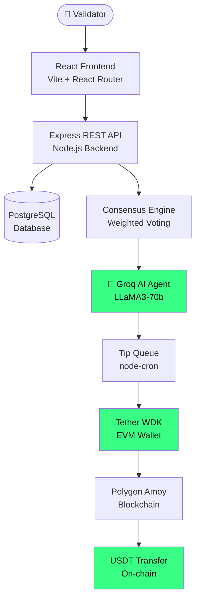
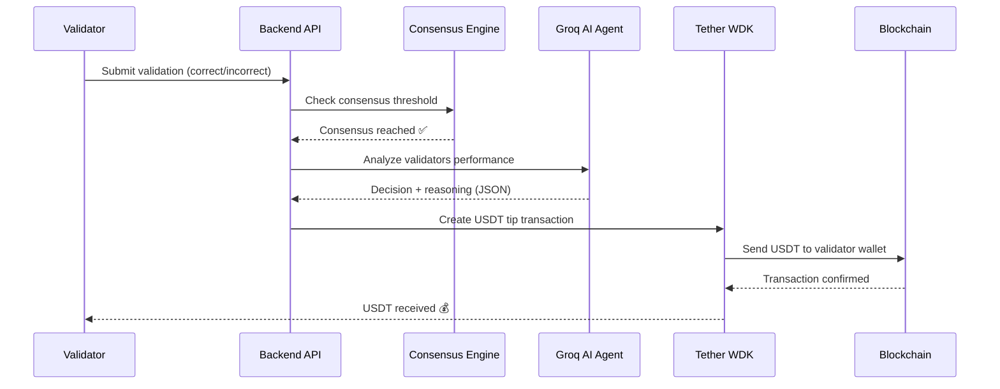
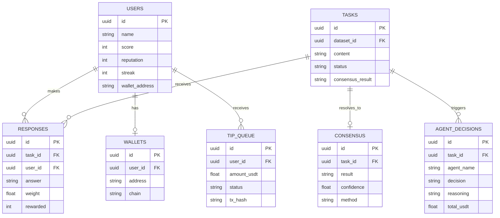

# System Architecture

```mermaid
flowchart TD
    User([👤 Validator]) --> FE[React Frontend\nVite + React Router]
    FE --> API[Express REST API\nNode.js Backend]
    API --> DB[(PostgreSQL\nDatabase)]
    API --> CE[Consensus Engine\nWeighted Voting]
    CE --> AI[🤖 Groq AI Agent\nLLaMA3-70b]
    AI --> TQ[Tip Queue\nnode-cron]
    TQ --> WDK[Tether WDK\nEVM Wallet]
    WDK --> BC[Polygon Amoy\nBlockchain]
    BC --> TX[USDT Transfer\nOn-chain]

    style AI fill:#39ff85,color:#000
    style WDK fill:#39ff85,color:#000
    style TX fill:#39ff85,color:#000
```

## Autonomous Agent Flow

```mermaid
sequenceDiagram
    participant U as Validator
    participant API as Backend API
    participant CE as Consensus Engine
    participant AI as Groq AI Agent
    participant WDK as Tether WDK
    participant BC as Blockchain

    U->>API: Submit validation (correct/incorrect)
    API->>CE: Check consensus threshold
    CE-->>API: Consensus reached ✅
    API->>AI: Analyze validators performance
    AI-->>API: Decision + reasoning (JSON)
    API->>WDK: Create USDT tip transaction
    WDK->>BC: Send USDT to validator wallet
    BC-->>WDK: Transaction confirmed
    WDK-->>U: USDT received 💰
```

## Database Schema

```mermaid
erDiagram
    USERS {
        uuid id PK
        string name
        int score
        int reputation
        int streak
        string wallet_address
    }
    TASKS {
        uuid id PK
        uuid dataset_id FK
        string content
        string status
        string consensus_result
    }
    RESPONSES {
        uuid id PK
        uuid task_id FK
        uuid user_id FK
        string answer
        float weight
        int rewarded
    }
    CONSENSUS {
        uuid id PK
        uuid task_id FK
        string result
        float confidence
        string method
    }
    WALLETS {
        uuid id PK
        uuid user_id FK
        string address
        string chain
    }
    AGENT_DECISIONS {
        uuid id PK
        uuid task_id FK
        string agent_name
        string decision
        string reasoning
        float total_usdt
    }
    TIP_QUEUE {
        uuid id PK
        uuid user_id FK
        float amount_usdt
        string status
        string tx_hash
    }

    USERS ||--o{ RESPONSES : makes
    USERS ||--o| WALLETS : has
    TASKS ||--o{ RESPONSES : receives
    TASKS ||--o| CONSENSUS : resolves_to
    TASKS ||--o{ AGENT_DECISIONS : triggers
    USERS ||--o{ TIP_QUEUE : receives
```